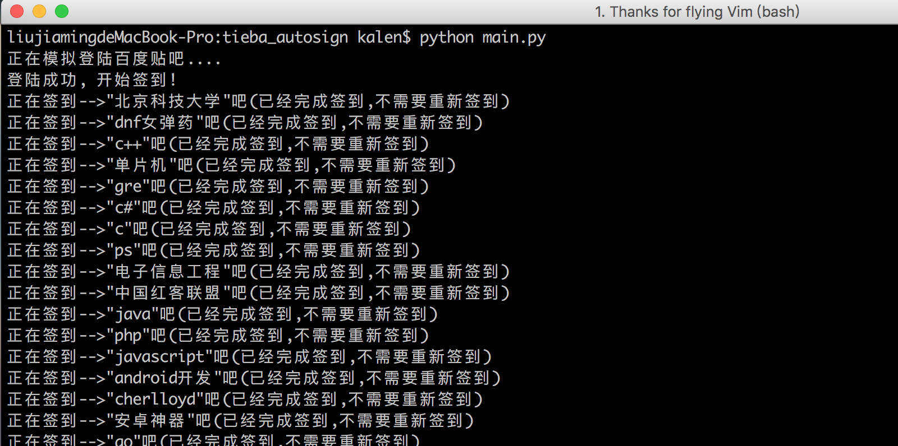

# tieba_autosign
百度贴吧自动签到
## 截图


## 安装
1、下载源码
``` shell
git clone https://github.com/nladuo/tieba_autosign.git
mv tieba_autosign/config.sample.py tieba_autosign/config.py
```
2、下载[phantomjs](http://phantomjs.org/)<br>
3、安装依赖库
``` shell
pip install selenium    # 安装selenium webdriver
pip install bs4         # 安装BeautifulSoup
```
3、修改配置(config.py)
``` python
username = u"你的用户名"
passwd = "your password"
exe_path = "/Users/kalen/Programfiles/phantomjs-2.1.1-macosx/bin/phantomjs"
```
4、签到
``` shell
python tieba_autosign.py   # 对常逛的贴吧逐个签到
```


## LICENSE
MIT
