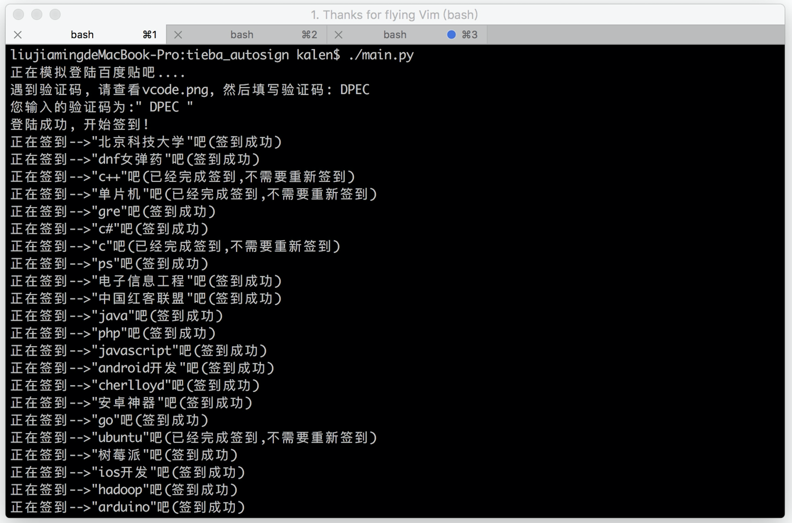

# tieba_autosign
百度贴吧自动签到
## 效果


## 安装
1、下载源码
``` shell
git clone https://github.com/nladuo/tieba_autosign.git
```
2、下载phantomjs  
3、安装python 库
``` shell
pip install selenium    # 安装selenium webdriver
pip install bs4         # 安装BeautifulSoup
```
3、修改配置
``` python
username = u"你的用户名"
passwd = "your password"
exe_path = "/Users/kalen/Programfiles/phantomjs-2.1.1-macosx/bin/phantomjs"
```
4、测试
``` shell
cd ./tieba_autosign
./tieba_autosign.py         #测试逐个签到, 目前有点问题
./tieba_onekey_sgign.py     #测试一键签到, 只能签到7级以上的贴吧，最多可签50个吧。
```


## LICENSE
MIT
